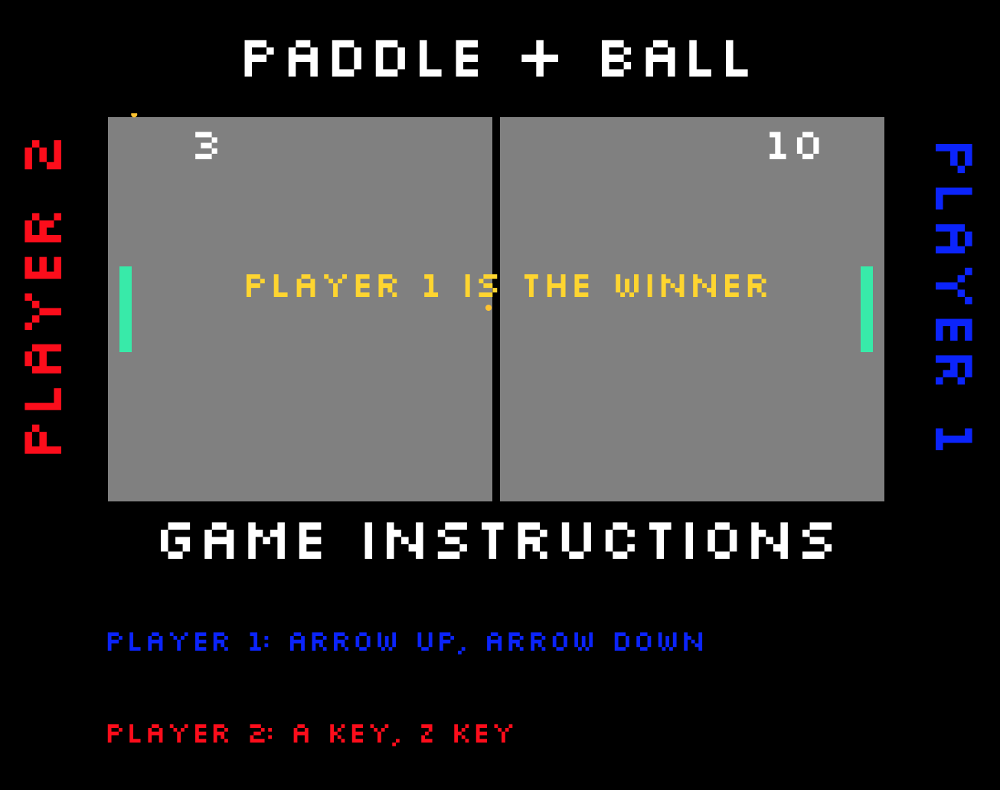

# Pong Game

Recreating a famous pong game created in 1972 by Atari. With the basic pong functions, I revamped Pong with my own styles and functions.

## Description

Use paddle to block and hit the ball to the opposite players goal line to gain a point.

# ScreenShot

## Setup

**Install dependencies:**

`> npm i`

**Run locally with Webpack Dev Server:**

`> npm start`

**Build for production:**

`> npm run build`

## Keys

**Player 1:**
* ▲ : up
* ▼: down

**Player 2:**
* a: up
* z: down

**Pause Game:**
* Space Bar

## Technology Used

* HTML5
* CSS3
* SVG
* JAVASCRIPT 
* ES6 & ES.NEXT

## Built With

* WebStorm
* Vim
* WebPack
* Github
* Chrome Developer Tools

## Stretch Goals

* Winner is declared with a message when total points is achieved.
* Ball changes size depend on board hit.
* Multiple Balls

## Personal Learning

Being able to do a code along with the class really helped me understand what I was coding and why we were using that specific code. 

* Class ES6
* ES5 
* Import settings etc
* WebPack
